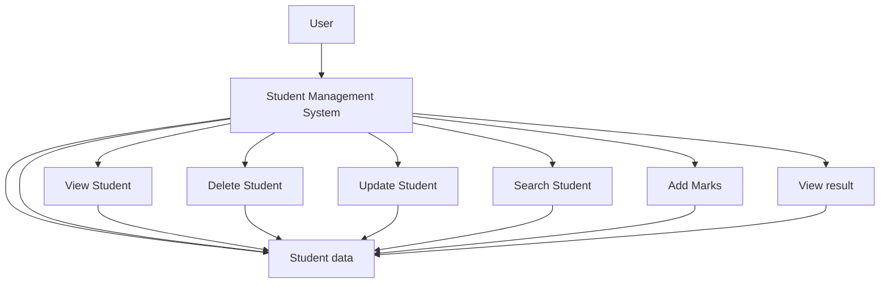

```mermaid
flowchart TD
A[User] --> B[Student Management System]
B --> C[Add Student]
B --> D[View Student]
B --> E[Delete Student]
B --> F[Update Student]
B --> G[Search Student]
B --> H[Add Marks]
B --> I[View result]

B --> C[Student data]
D --> C
E --> C
F --> C
G --> C
H --> C
I --> C
```

